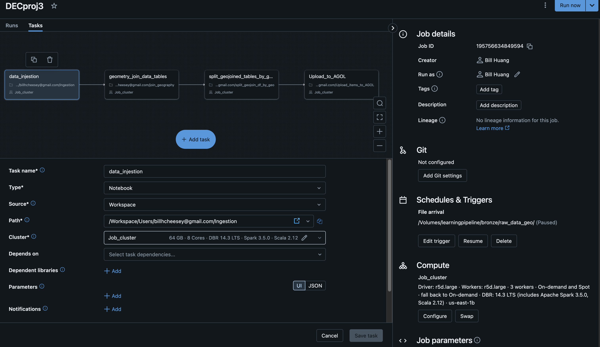
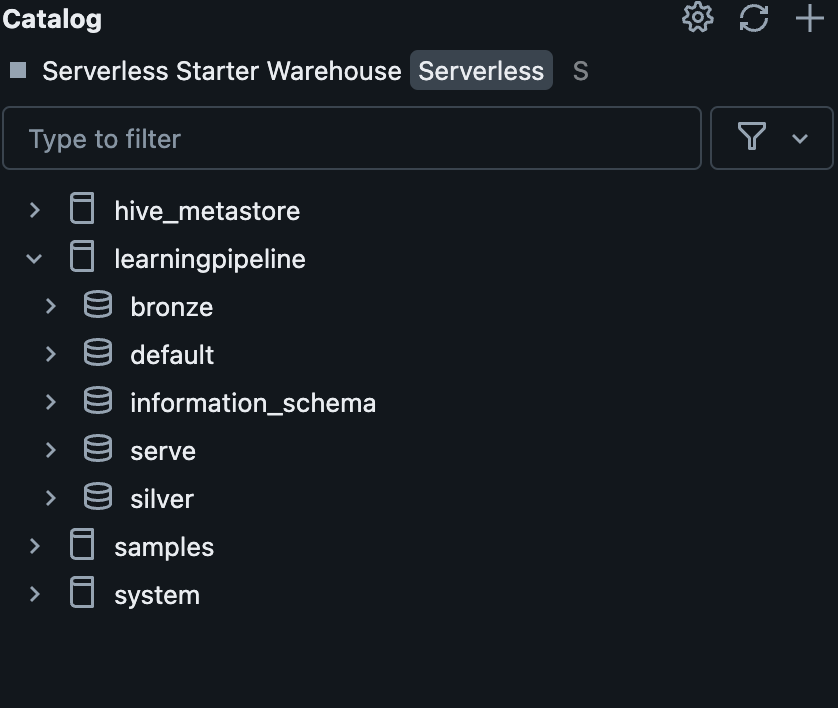

# DECproj3
project 3 of the data engineering camp April 2024 Cohort

I am used the Databricks platorm for the whole ETL Pipeline.

When files are uploaded to the Unity Catalog Volume, the Databricks Workflows is triggered to injest the data from the source volume to tables in the broze layer schema. Then the data is transformed by joins into the silver schema, then the data is transformed and served through filtering to the serve schema.
The serve schema has 1000+ tables as an output.

The serve tables are then uploaded to the ArcGIS Online platform using the arcigs API for python and every has it's meta data customized with the manifest data tables in Databricks.

