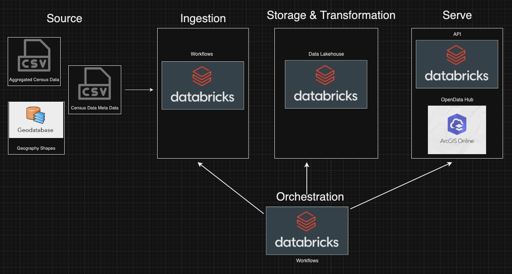
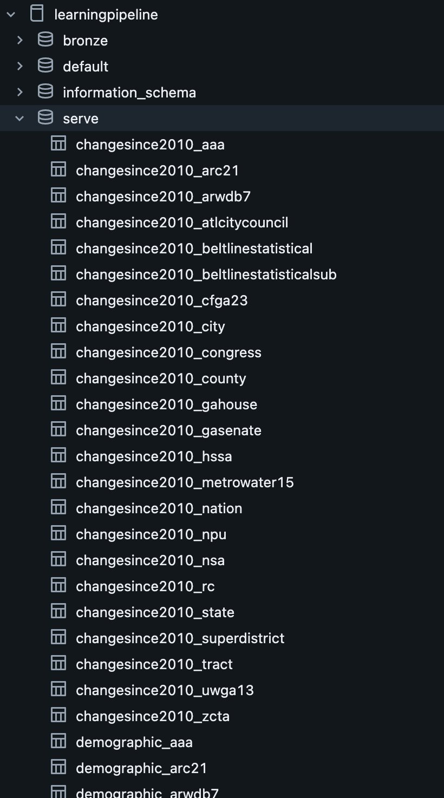

# Bill Huang Project 3 Plan DEC 2024 Summer
Objective
The objective is to provide preprocessed US Census data for the Atlanta region to be more usable for city planning professionals. I would like to automate and create a data store for the data to be served. This is a goal for my work organization.

Consumers
City planners within our organization and other governmental entities would find it useful as they need access to such data to make any plans. They want it as downloadable files or API links.

Questions
How many people live within a neighborhood?
What is the area median income for my census tract?

Source datasets
The source datasets update every year.
The source datasets would be CSVs and geodatabase files that are custom processed and cleaned as they change year to year.

Solution architecture
I am used the Databricks platorm for the whole ETL Pipeline besides the final serve.

When files are uploaded to the Unity Catalog Volume, the Databricks Workflows is triggered to injest the data from the source volume to tables in the broze layer schema. Then the data is transformed by joins into the silver schema, then the data is transformed and served through filtering to the serve schema.
The serve schema has 1000+ tables as an output.

The serve tables are then uploaded to the ArcGIS Online platform using the arcigs API for python and every has it's meta data customized with the manifest data tables in Databricks.

